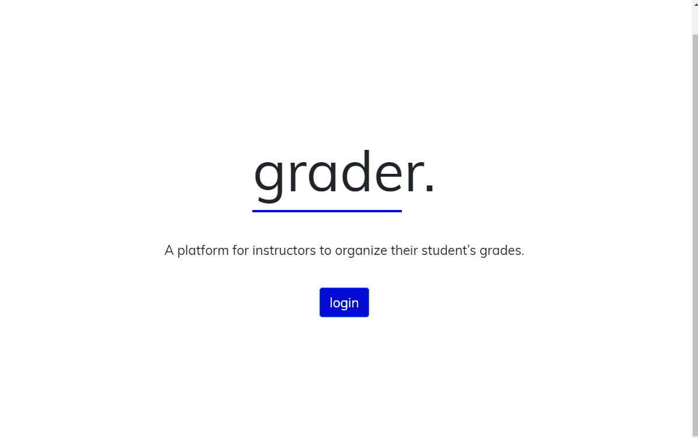

# grader

A full stack React application where teachers can keep track of their classes, students, and grades

Mobile and Desktop Oriented

## Technologies Used

- React.js
- Webpack 4
- Bootstrap 4
- PHP
- MySQL
- HTML5
- CSS3
- AWS EC2

## Live Demo

Try the application live at [https://grader.uzairashraf.dev/](https://grader.uzairashraf.dev/)

To login use any of the two premade users

## Features

- User can create classes
- User can update class information
- User can delete classes
- User can create students
- User can update students information
- User can delete students
- User can add grades to classes for their students
- User can update grades
- User can delete grades


## Preview




## Development

#### System Requirements

- NPM 6 or higher
- MySQL 7 or higher

#### Getting Started

1. Clone the repository.

    ```shell
    git clone https://github.com/uzair-ashraf/grader.git
    cd good-deed
    ```

1. Install all dependencies with NPM.

    ```shell
    npm install
    ```

1. Import the example database to MySQL.

    ```shell
    database/grader.sql
    ```

1. Start the project. Once started you can view the application by opening http://localhost:3000 in your browser.

    ```shell
    npm run dev
    ```
